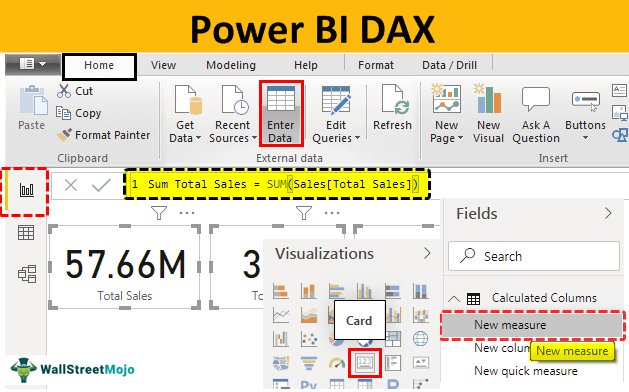

# NORAM Microsoft Power BI Pro Training

## Importing Data Sources:

We will import the folllwing data sources:
* Product Sales Data "Text File"
* Customer Mapping File "Excel File"
* Product Attributes Data "Excel File"